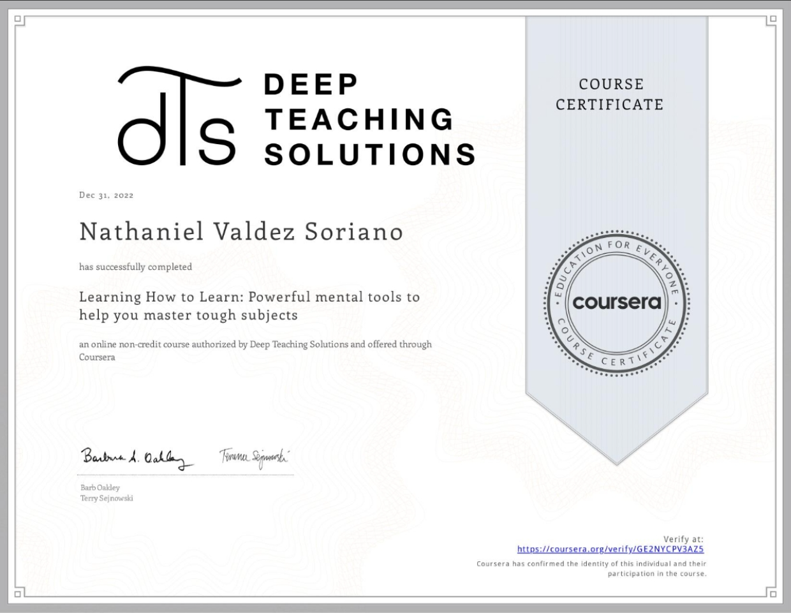

# #100Devs Hacks
This repository contains the things I've done as I follow the cohort at my own pace.  

LINK: https://nathaniel330.github.io/100Devs-Hacks/

  

 

 

## #100Devs Homework Checklist
| STATUS | TASK | WORK |
| :----: | ---- | :----: |
| &#9745; | Complete [Coursera — Learning How To Learn](https://www.coursera.org/learn/learning-how-to-learn) |    [[CERTIFICATE]](public/document/Coursera%20GE2NYCPV3AZ5.pdf) |
| &#9745; |Watch [How to Study for Exams: Evidence-based Revision Tips](https://youtu.be/ukLnPbIffxE) by Ali Abdaal |  |
| &#9745; | Watch [How to Study for Exams: Spaced Repitition](https://youtu.be/Z-zNHHpXoMM) by Ali Abdaal |  |
| &#9745; | Build HTML for [BBC Website](public/img/resources/bbc-image.png) |    [[LINK]](https://nathaniel330.github.io/100Devs-Hacks/homework/html-bbc/) |
| &#9745; | Use [MDN Web Docs](https://developer.mozilla.org/en-US/) |  |
| &#9745; | Read [Shay Howe: Learn to Code](https://learn.shayhowe.com/html-css/) |  |
| &#9745; | Finish [Khan Academy](public/img/resources/khan-academy.png) markup |    [[LINK]](https://nathaniel330.github.io/100Devs-Hacks/homework/html-khan-academy/) |
| &#9745; | Finish [Tech Crunch](public/img/resources/techcrunch.png) markup |    [[LINK]](https://nathaniel330.github.io/100Devs-Hacks/homework/html-techcrunch/) |
| &#9745; | Read [Learn layout](https://learnlayout.com/)|  |
| &#9744; | Finish [Simple Site Lab](public/img/resources/simple-site-lab.png) |  |
| &#9745; | Complete Basic Layouts: <li>[Layout 1](public/img/resources/layout1.png) </li> <li>[Layout 2](public/img/resources/layout2.png)</li><li>[Layout 3](public/img/resources/layout3.png)</li> |    [[LAYOUT 1]](https://nathaniel330.github.io/100Devs-Hacks/homework/layout1/)       [[LAYOUT 2]](https://nathaniel330.github.io/100Devs-Hacks/homework/layout2/)       [[LAYOUT 3]](https://nathaniel330.github.io/100Devs-Hacks/homework/layout3/) |
| &#9744; | Read [Shaye Howe: Responsive Design](https://learn.shayhowe.com/advanced-html-css/responsive-web-design/) |  |
| &#9744; | Make [15 minutes of pain](public/img/resources/15-min-pain.png) responsive (use floats and 3 media queries) |  |
| &#9744; | Read [Shay Howe: Advanced](https://learn.shayhowe.com/advanced-html-css/) |  |
| &#9745; | Read [A Guide to Flexbox](https://css-tricks.com/snippets/css/a-guide-to-flexbox/) |  |
| &#9745; | Do [Flexbox Froggy](https://flexboxfroggy.com/) |  |
| &#9744; | Watch Independence Day (1996 movie) |  |
| &#9744; | Complete the Layouts for:<li>[BBC](public/img/resources/bbc-image.png)</li><li>[Khan Academy](public/img/resources/khan-academy.png)</li><li>[Tech Crunch](public/img/resources/techcrunch.png)</li> |  |
| &#9744; | Do the [Level Ground](public/img/resources/level-ground.png) & [Source](public/img/resources/source.png) layouts |  |
| &#9744; | Do the [Restaurant](public/img/resources/restaurant.png) & [Hair Salon](public/img/resources/hair-salon.png) layouts |  |
| &#9744; | Watch [JavaScript crash course for beginners](https://youtu.be/hdI2bqOjy3c) |  |
| &#9744; | Extras<li>Complete [Pushwork](public/img/resources/pushwork.png) layout</li><li>Add media queries to other layouts</li><li>[FCC Flexbox Tutorial](https://www.freecodecamp.org/news/css-flexbox-tutorial-with-cheatsheet/)</li><li>[Flexbox in 20 minutes](https://youtu.be/JJSoEo8JSnc)</li><li>[Flexbox Zombies](https://mastery.games/flexboxzombies/)</li> |  |
| &#9745; | Read and do the tasks: <li>[Javascript.info: Variables](https://javascript.info/variables)</li> <li>[Javascript.info: Function Basics](https://javascript.info/function-basics)</li> <li>[Javascript.info: Function Expressions](https://javascript.info/function-expressions)</li> <li>[Javascript.info: Arrow Function Basics](https://javascript.info/arrow-functions-basics)</li> <li>[Javascript.info: Array Methods](https://javascript.info/array-methods)</li> <li>[Javascript.info: Objects](https://javascript.info/object-basics)</li> |  |
| &#9744; | Read and do the tasks: <li>[The JS Way: Loops](https://github.com/thejsway/thejsway/blob/master/manuscript/chapter04.md)</li> <li>[The JS Way: Arrays](https://github.com/thejsway/thejsway/blob/master/manuscript/chapter07.md)</li> <li>[The JS Way: Objects](https://github.com/thejsway/thejsway/blob/master/manuscript/chapter06.md)</li> <li>[The JS Way: Object-Oriented Programming](https://github.com/thejsway/thejsway/blob/master/manuscript/chapter09.md)</li> |  |
| &#9744; | Set up portfolio |  |
| &#9744; | Draft proposal/contract |  |
| &#9744; | Watch [Git and GitHub crash course](https://youtu.be/SWYqp7iY_Tc) |  |
| &#9744; | Read [Eloquent Javascript: Objects and Arrays](https://eloquentjavascript.net/04_data.html) and do the tasks |  |
| &#9745; | Do [Javascript 30: Day 04 Array Cardio](https://javascript30.com/) | [[LINK]](https://nathaniel330.github.io/100Devs-Hacks/homework/javascript-30-array-cardio/) |
| &#9744; | Watch and do [Object-Oriented Javascript](https://youtu.be/PFmuCDHHpwk) |  |
| &#9744; | Set up [WSL](https://ubuntu.com/wsl) |  |
| &#9744; | Extras <li>Complete [Javascript Calculator](https://github.com/leonnoel/100devs-calculator)</li> <li>Read [Pillars of OOP](https://medium.com/@hamzzza.ahmed95/four-pillars-of-object-oriented-programming-oop-e8d7822aa219)</li> |  |  |
| &#9744; | Complete the [Professional Checklist](https://docs.google.com/document/d/1L2vTX3qvLhoGHeG5cVD2ljCfRGr1uJ_Gf-hNZj9KzTg/edit) |  |
| &#9744; | Make the [cocktailDB API](https://www.thecocktaildb.com/api.php) work with spaces between the names! | [[LINK]](https://nathaniel330.github.io/100Devs-Hacks/homework/cocktailDB-API/) |
| &#9744; | Find three APIs from [this list](https://github.com/public-apis/public-apis) (not all of them work) and build three simple apps using those APIs. |  |
| &#9744; | Watch [Object-oriented Programming in JavaScript](https://youtu.be/PFmuCDHHpwk)|  |
| &#9744; | Read [Eloquent JS: The Secret Life of Objects](https://eloquentjavascript.net/06_object.html) |  |
| &#9744; | Get a paid client, volunteer, or contribute to open source software |  |
| &#9744; | <li>Read [MDN: Async/Await](https://developer.mozilla.org/en-US/docs/Learn/JavaScript/Asynchronous/Promises)</li><li>Watch The [Async/Await Episode](https://youtu.be/vn3tm0quoqE)</li><li>Read [Modern Javascript For Dinosaurs](https://medium.com/the-node-js-collection/modern-javascript-explained-for-dinosaurs-f695e9747b70)</li><li>Watch [Node.js crash course](https://youtu.be/fBNz5xF-Kx4)</li><li>Start prepping [THE BANK](https://docs.google.com/document/d/1p7DhCsLOMMybYfePWLlD1-_8KU20zkBoArH4pnW1o3c/edit)</li><li>Watch our [Crafting Your Story](https://youtu.be/QoweoDsi5ZI) class from last cohort</li><li>Read [Javascript.info: Async/Await](https://javascript.info/async) and do the tasks</li> |  |
| &#9744; | <li>Watch [What the heck is the event loop?](https://youtu.be/8aGhZQkoFbQ)</li><li>Watch [In the loop](https://youtu.be/cCOL7MC4Pl0)</li><li>Read and do [Build a CRUD app](https://zellwk.com/blog/crud-express-mongodb/)</li><li>Make a coin flip game where the randomization happens server side</li> |  |
| &#9744; | <li>Start prepping [THE BANK](https://docs.google.com/document/d/1p7DhCsLOMMybYfePWLlD1-_8KU20zkBoArH4pnW1o3c/edit) - More!</li><li>Read [Fullstack Open: Node.js and Express](https://fullstackopen.com/en/part3/node_js_and_express)</li> |  |
| &#9744; | Make your own API and deploy it |  |
| &#9744; | Work with a group to comment every line of [this to-do list](https://github.com/100devs/todo-list-express) and submit a pull request with your completed code. |  |
| &#9744; | <li>Watch [DevMarketer's MVC video](https://youtu.be/1IsL6g2ixak)</li><li>Watch [Node.js App From Scratch](https://youtu.be/SBvmnHTQIPY)</li><li>Work in a group to build out a lecture on MVC</li> |  |
| &#9744; | Work in a group to improve the [todo list](https://github.com/100devs/todo-mvc-auth-local) |  |
| &#9744; | Work together with a group to add comments to [Binary Upload Boom](https://github.com/100devs/binary-upload-boom) and submit a pull request with your completed code |  |
| &#9744; | Watch Traversy Media's [React.js Crash Course](https://youtu.be/w7ejDZ8SWv8) |  |
| &#9744; | Do Kent C. Dodd's [Beginner's Guide to React](https://egghead.io/courses/the-beginner-s-guide-to-react) |  |
| &#9744; | <li>Study [THE BANK](https://docs.google.com/document/d/1p7DhCsLOMMybYfePWLlD1-_8KU20zkBoArH4pnW1o3c/edit)</li><li>Complete [Scotch.io Ultimate Algorithms Course](http://web.archive.org/web/20210616161653/https://scotch.io/courses/the-ultimate-guide-to-javascript-algorithms)</li> |  |
| &#9744; | Complete [Practical Algorithms Course](https://frontendmasters.com/courses/practical-algorithms/) |  |
